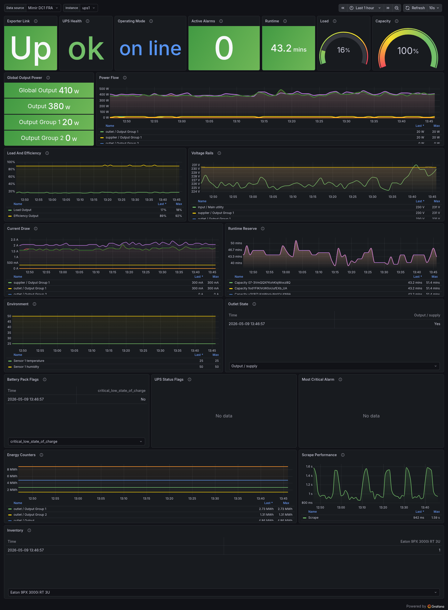

# eaton-m3-exporter

Prometheus exporter for Eaton Network M3 cards using the REST API v2.0.

## Features

- Scrapes multiple Network M3 cards from one exporter process.
- Authenticates with the card OAuth token endpoint and sends Bearer tokens on API requests.
- Verifies TLS by default, with explicit per-target opt-out for self-signed devices.
- Exposes read-only core UPS metrics for power, alarms, runtime, battery/power bank, inputs, outputs, outlets, and environment sensors.
- Serves `/metrics` and `/healthz`.

## Build

```sh
go build -o bin/eaton-m3-exporter ./cmd/eaton-m3-exporter
```

Or use the Makefile:

```sh
make build
```

## Configuration

Create a YAML configuration file:

```yaml
listen_addr: ":9734"
scrape_timeout: 10s
api_version: "2.0"

targets:
  - name: "ups-main"
    base_url: "https://192.0.2.10"
    username: "admin"
    password: "change-me"
    insecure_skip_verify: false
```

See `configs/example.yaml` for a multi-card example.

## Run

```sh
./bin/eaton-m3-exporter --config config.yaml --log-level info
```

Flags:

- `--config <path>`: path to YAML config, default `config.yaml`.
- `--log-level <debug|info|warn|error>`: default `info`.
- `--version`: print build metadata and exit.

## Prometheus

```yaml
scrape_configs:
  - job_name: eaton-m3
    static_configs:
      - targets: ["exporter-host:9734"]
```

## Metrics

All card metrics include `target` and `base_url` labels. Resource metrics add stable labels such as `resource_type`, `resource_id`, `name`, `supplier`, `sensor`, or `input`.

Examples:

- `eaton_m3_up`
- `eaton_m3_scrape_duration_seconds`
- `eaton_m3_scrape_errors_total`
- `eaton_m3_alarm_active_count`
- `eaton_m3_alarm_total_count`
- `eaton_m3_alarm_most_critical`
- `eaton_m3_power_distribution_status`
- `eaton_m3_power_service_status`
- `eaton_m3_environment_status`
- `eaton_m3_voltage_volts`
- `eaton_m3_current_amperes`
- `eaton_m3_frequency_hertz`
- `eaton_m3_active_power_watts`
- `eaton_m3_apparent_power_va`
- `eaton_m3_load_percent`
- `eaton_m3_capacity_runtime_seconds`
- `eaton_m3_protection_capacity_percent`
- `eaton_m3_power_bank_status`
- `eaton_m3_temperature_kelvin`
- `eaton_m3_humidity_percent`
- `eaton_m3_environment_input_active`

String states are exported as enum-style gauges with value `1` for the current state. Boolean API fields are exported as `0` or `1` gauges.

## Development

```sh
make test
make race
make vet
make lint
```

`make lint` requires `golangci-lint` to be installed.

## Grafana Dashboard

A ready-to-import Grafana dashboard is available at `dashboards/eaton-m3-exporter.json`.



It follows the same variable pattern as the reference dashboards:

- `datasource`: Prometheus datasource selector.
- `instance`: target selector populated by `label_values(eaton_m3_up, target)`.

The dashboard focuses on operational use: scrape health, UPS health and mode, alarms, load, runtime, capacity, power flow, voltage, current, environment sensors, outlet state, battery flags, and inventory.
